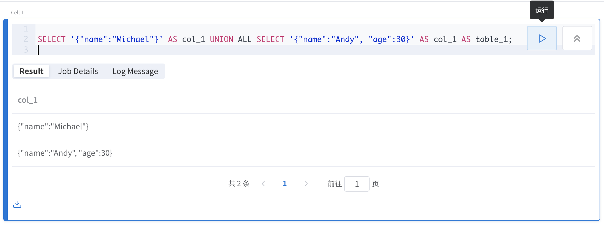

# 使用笔记本

在工作区页面，您可以创建、编辑或运行笔记本。

### 操作笔记本

在笔记本的上方，有一排操作按钮，如下图所示：

他们的操作含义分别是：

**新建笔记本**：新建一个笔记本，将当如 root 目录下；

**重命名**：重命名当前笔记本；

**克隆**：克隆当前笔记本，将放入同级目录下；

**删除当前笔记本**：删除当前笔记本，请谨慎操作，删除后不可恢复；

**保存**：保存当前编辑；

**新增单元格**：在笔记本内新增一个单元格；

**运行**：运行光标所在的单元格；

**运行下一个**：运行光标所在的单元格的下一个单元格；

**运行所有**：运行笔记本内的所有单元格；

**删除**：删除光标所在的单元格；

**清楚所有结果**：清楚运行笔记本后的结果；

**选择语言**：选择单元格内的语言，支持 Kolo、Python、Markdown 语言；

**显示快捷帮助**：您可以通过快捷键操作笔记本，如切换到编辑模式、运行单元格等，点击**显示快捷帮助**按钮将提示所有可用的快捷操作。

### 编辑笔记本

您可以在笔记本内创建多个单元格，在不同单元格中写不同的语句以完成各项操作。鼠标悬浮在单元格上将在右侧显示**运行**按钮，点击后将运行单元格内的代码，运行后您可以查询结果、任务详情或日志信息，您也可以下载运行结果到 CSV 文件，如下图所示：

鼠标悬浮在单元格左侧，点击出现的 ➕ 按钮，您可以快速添加一个单元格，将添加在光标所在单元格的下方，你也可以托住当前单元格上下滑动以调整所有单元格的顺序。

